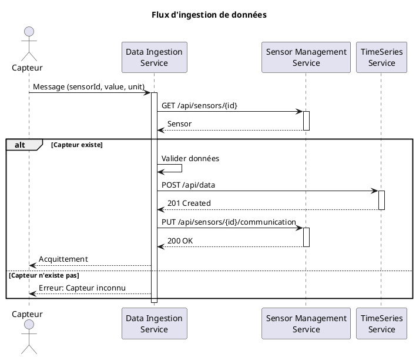
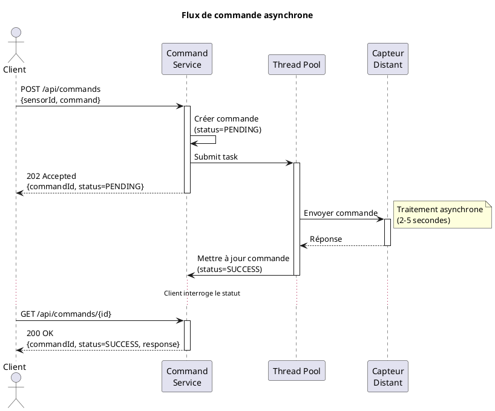

# Exemples de code pour la migration

## 📚 Table des matières

1. [REST Client inter-services](#1-rest-client-inter-services)
2. [Commande asynchrone](#2-commande-asynchrone)
3. [Gestion des erreurs](#3-gestion-des-erreurs)
4. [Simulation du broker](#4-simulation-du-broker)
5. [Diagrammes PlantUML](#5-diagrammes-plantuml)

---

## 1. REST Client inter-services

### 1.1 Définir l'interface client

```java
// filepath: src/main/java/fr/esgi/client/SensorManagementClient.java
package fr.esgi.client;

import fr.esgi.model.Sensor;
import jakarta.ws.rs.*;
import jakarta.ws.rs.core.MediaType;
import org.eclipse.microprofile.rest.client.inject.RegisterRestClient;

@Path("/api/sensors")
@RegisterRestClient(configKey = "sensor-management")
@Produces(MediaType.APPLICATION_JSON)
@Consumes(MediaType.APPLICATION_JSON)
public interface SensorManagementClient {
    
    @GET
    @Path("/{id}")
    Sensor getSensorById(@PathParam("id") String id);
    
    @PUT
    @Path("/{id}/communication")
    void updateLastCommunication(@PathParam("id") String id);
    
    @GET
    List<Sensor> getAllSensors();
}
```

### 1.2 Configuration

```properties
# application.properties
sensor-management/mp-rest/url=http://localhost:8081
sensor-management/mp-rest/scope=jakarta.inject.Singleton
# Timeout en millisecondes
sensor-management/mp-rest/connectTimeout=1000
sensor-management/mp-rest/readTimeout=3000
```

### 1.3 Utilisation dans un service

```java
package fr.esgi.service;

import fr.esgi.client.SensorManagementClient;
import fr.esgi.model.Sensor;
import jakarta.enterprise.context.ApplicationScoped;
import jakarta.inject.Inject;
import org.eclipse.microprofile.rest.client.inject.RestClient;
import org.jboss.logging.Logger;

@ApplicationScoped
public class DataIngestionService {
    
    private static final Logger LOG = Logger.getLogger(DataIngestionService.class);
    
    @Inject
    @RestClient
    SensorManagementClient sensorClient;
    
    public void processSensorData(String sensorId, double value) {
        try {
            // Appel REST vers sensor-management-service
            Sensor sensor = sensorClient.getSensorById(sensorId);
            
            if (sensor == null) {
                LOG.warnf("Capteur inconnu: %s", sensorId);
                return;
            }
            
            LOG.infof("Traitement donnée pour capteur: %s", sensor.getName());
            
            // ... logique métier ...
            
            // Mise à jour de la dernière communication
            sensorClient.updateLastCommunication(sensorId);
            
        } catch (Exception e) {
            LOG.errorf("Erreur lors de la communication avec sensor-management: %s", 
                      e.getMessage());
        }
    }
}
```

---

## 2. Commande asynchrone

### 2.1 Service avec CompletableFuture

```java
// filepath: src/main/java/fr/esgi/service/CommandService.java
package fr.esgi.service;

import fr.esgi.model.Command;
import jakarta.enterprise.context.ApplicationScoped;
import org.jboss.logging.Logger;

import java.time.LocalDateTime;
import java.util.Map;
import java.util.UUID;
import java.util.concurrent.CompletableFuture;
import java.util.concurrent.ConcurrentHashMap;

@ApplicationScoped
public class CommandService {
    
    private static final Logger LOG = Logger.getLogger(CommandService.class);
    
    private final Map<String, Command> commands = new ConcurrentHashMap<>();
    
    /**
     * Envoie une commande de manière asynchrone.
     * Retourne immédiatement l'ID de la commande.
     */
    public String sendCommandAsync(String sensorId, String commandType) {
        String commandId = UUID.randomUUID().toString();
        
        Command command = new Command(commandId, sensorId, commandType);
        command.setStatus("PENDING");
        command.setSentAt(LocalDateTime.now());
        
        commands.put(commandId, command);
        
        LOG.infof("📤 Commande %s créée (PENDING)", commandId);
        
        // Traitement asynchrone
        CompletableFuture.runAsync(() -> processCommand(command));
        
        return commandId;
    }
    
    /**
     * Traite la commande de manière asynchrone.
     * Cette méthode s'exécute dans un thread séparé.
     */
    private void processCommand(Command command) {
        try {
            LOG.infof("⏳ Traitement de la commande %s...", command.getId());
            
            // Simulation de l'envoi vers le capteur distant
            Thread.sleep(2000 + (long) (Math.random() * 3000));
            
            // Simulation de la réponse
            boolean success = Math.random() > 0.2;
            
            if (success) {
                command.setStatus("SUCCESS");
                command.setResponse(generateResponse(command.getCommand()));
                LOG.infof("✅ Commande %s terminée avec succès", command.getId());
            } else {
                command.setStatus("FAILED");
                command.setResponse("Timeout ou capteur injoignable");
                LOG.warnf("❌ Commande %s échouée", command.getId());
            }
            
        } catch (InterruptedException e) {
            Thread.currentThread().interrupt();
            command.setStatus("FAILED");
            command.setResponse("Erreur: " + e.getMessage());
            LOG.errorf("❌ Erreur commande %s: %s", command.getId(), e.getMessage());
        }
    }
    
    public Optional<Command> getCommand(String commandId) {
        return Optional.ofNullable(commands.get(commandId));
    }
    
    private String generateResponse(String commandType) {
        return switch (commandType) {
            case "READ_VALUE" -> "Valeur: " + (15 + Math.random() * 15) + "°C";
            case "RESET" -> "Capteur réinitialisé";
            case "CALIBRATE" -> "Calibration OK";
            default -> "Commande exécutée";
        };
    }
}
```

### 2.2 API REST avec 202 Accepted

```java
// filepath: src/main/java/fr/esgi/api/CommandResource.java
package fr.esgi.api;

import fr.esgi.model.Command;
import fr.esgi.service.CommandService;
import jakarta.inject.Inject;
import jakarta.ws.rs.*;
import jakarta.ws.rs.core.MediaType;
import jakarta.ws.rs.core.Response;
import jakarta.ws.rs.core.UriBuilder;

import java.net.URI;
import java.util.Map;

@Path("/api/commands")
@Produces(MediaType.APPLICATION_JSON)
@Consumes(MediaType.APPLICATION_JSON)
public class CommandResource {
    
    @Inject
    CommandService commandService;
    
    /**
     * Envoie une commande (asynchrone).
     * Retourne 202 Accepted avec l'ID de la commande.
     */
    @POST
    public Response sendCommand(CommandRequest request) {
        // Validation
        if (request.sensorId == null || request.command == null) {
            return Response.status(Response.Status.BAD_REQUEST)
                    .entity(Map.of("error", "sensorId et command requis"))
                    .build();
        }
        
        // Envoi asynchrone (retourne immédiatement)
        String commandId = commandService.sendCommandAsync(
                request.sensorId,
                request.command
        );
        
        // Construction de l'URL de suivi
        URI location = UriBuilder.fromPath("/api/commands/{id}")
                .build(commandId);
        
        // Retour 202 Accepted
        return Response.status(Response.Status.ACCEPTED)
                .location(location)
                .entity(Map.of(
                        "commandId", commandId,
                        "status", "PENDING",
                        "message", "Commande en cours de traitement"
                ))
                .build();
    }
    
    /**
     * Récupère le statut d'une commande.
     */
    @GET
    @Path("/{id}")
    public Response getCommandStatus(@PathParam("id") String commandId) {
        return commandService.getCommand(commandId)
                .map(command -> Response.ok(command).build())
                .orElse(Response.status(Response.Status.NOT_FOUND)
                        .entity(Map.of("error", "Commande non trouvée"))
                        .build());
    }
    
    public static class CommandRequest {
        public String sensorId;
        public String command;
    }
}
```

### 2.3 Client qui utilise l'API asynchrone

```bash
# Envoyer une commande
curl -X POST http://localhost:8084/api/commands \
  -H "Content-Type: application/json" \
  -d '{"sensorId":"TEMP-001","command":"READ_VALUE"}'

# Réponse:
# {
#   "commandId": "abc123...",
#   "status": "PENDING",
#   "message": "Commande en cours de traitement"
# }

# Vérifier le statut (polling)
curl http://localhost:8084/api/commands/abc123...

# Réponse (si terminée):
# {
#   "id": "abc123...",
#   "sensorId": "TEMP-001",
#   "command": "READ_VALUE",
#   "status": "SUCCESS",
#   "response": "Valeur: 23.5°C",
#   "sentAt": "2024-01-15T10:30:00"
# }
```

---

## 3. Gestion des erreurs

### 3.1 Retry + Fallback

```java
package fr.esgi.service;

import fr.esgi.client.SensorManagementClient;
import fr.esgi.model.Sensor;
import jakarta.enterprise.context.ApplicationScoped;
import jakarta.inject.Inject;
import org.eclipse.microprofile.faulttolerance.Fallback;
import org.eclipse.microprofile.faulttolerance.Retry;
import org.eclipse.microprofile.faulttolerance.Timeout;
import org.eclipse.microprofile.rest.client.inject.RestClient;
import org.jboss.logging.Logger;

import java.time.temporal.ChronoUnit;

@ApplicationScoped
public class ResilientDataService {
    
    private static final Logger LOG = Logger.getLogger(ResilientDataService.class);
    
    @Inject
    @RestClient
    SensorManagementClient sensorClient;
    
    /**
     * Appel résilient avec retry + timeout + fallback.
     */
    @Retry(
        maxRetries = 3,                    // 3 tentatives
        delay = 500,                        // 500ms entre chaque
        delayUnit = ChronoUnit.MILLIS,
        jitter = 200                        // Aléatoire ±200ms
    )
    @Timeout(value = 2, unit = ChronoUnit.SECONDS)  // Max 2 secondes
    @Fallback(fallbackMethod = "getSensorFallback")
    public Sensor getSensor(String sensorId) {
        LOG.infof("🔄 Appel getSensor pour: %s", sensorId);
        return sensorClient.getSensorById(sensorId);
    }
    
    /**
     * Méthode de fallback en cas d'échec.
     */
    public Sensor getSensorFallback(String sensorId) {
        LOG.warnf("⚠️ Fallback activé pour capteur: %s", sensorId);
        
        // Option 1 : Retourner un capteur par défaut
        Sensor defaultSensor = new Sensor();
        defaultSensor.setId(sensorId);
        defaultSensor.setName("Unknown (fallback)");
        defaultSensor.setType("UNKNOWN");
        defaultSensor.setStatus("UNKNOWN");
        
        return defaultSensor;
        
        // Option 2 : Lancer une exception métier
        // throw new SensorNotFoundException("Capteur inaccessible: " + sensorId);
    }
}
```

### 3.2 Circuit Breaker

```java
import org.eclipse.microprofile.faulttolerance.CircuitBreaker;

@ApplicationScoped
public class CircuitBreakerService {
    
    @CircuitBreaker(
        requestVolumeThreshold = 4,     // Minimum 4 requêtes
        failureRatio = 0.5,              // 50% d'échecs
        delay = 5,                       // Attendre 5 secondes
        delayUnit = ChronoUnit.SECONDS,
        successThreshold = 2             // 2 succès pour réouvrir
    )
    @Fallback(fallbackMethod = "fallbackGetSensor")
    public Sensor getSensor(String sensorId) {
        return sensorClient.getSensorById(sensorId);
    }
    
    public Sensor fallbackGetSensor(String sensorId) {
        LOG.warn("Circuit ouvert ! Service sensor-management inaccessible");
        throw new ServiceUnavailableException("Service temporairement indisponible");
    }
}
```

---

## 4. Simulation du broker

### 4.1 Broker simulé avec Scheduler

```java
// filepath: src/main/java/fr/esgi/simulator/MessageBrokerSimulator.java
package fr.esgi.simulator;

import io.quarkus.scheduler.Scheduled;
import jakarta.enterprise.context.ApplicationScoped;
import jakarta.inject.Inject;
import org.jboss.logging.Logger;

import java.util.Random;

@ApplicationScoped
public class MessageBrokerSimulator {
    
    private static final Logger LOG = Logger.getLogger(MessageBrokerSimulator.class);
    
    @Inject
    DataIngestionClient ingestionClient;
    
    private final Random random = new Random();
    private final String[] sensorIds = {"TEMP-001", "TEMP-002", "HUM-001", "PRESS-001"};
    
    /**
     * Génère des données toutes les 10 secondes.
     */
    @Scheduled(every = "10s", delay = 5)
    public void generateSensorData() {
        String sensorId = sensorIds[random.nextInt(sensorIds.length)];
        double value = generateValue(sensorId);
        String unit = getUnit(sensorId);
        
        LOG.infof("📨 Génération donnée - Capteur: %s, Valeur: %.2f %s", 
                  sensorId, value, unit);
        
        // Envoi vers data-ingestion-service
        SensorDataMessage message = new SensorDataMessage(sensorId, value, unit);
        ingestionClient.ingest(message);
    }
    
    private double generateValue(String sensorId) {
        if (sensorId.startsWith("TEMP")) {
            return 15 + random.nextDouble() * 15;
        } else if (sensorId.startsWith("HUM")) {
            return 40 + random.nextDouble() * 40;
        } else {
            return 980 + random.nextDouble() * 60;
        }
    }
    
    private String getUnit(String sensorId) {
        if (sensorId.startsWith("TEMP")) return "°C";
        if (sensorId.startsWith("HUM")) return "%";
        return "hPa";
    }
}
```

---

## 5. Diagrammes PlantUML

### 5.1 Diagramme C4 - Niveau 2 (Conteneurs)

```plantuml
@startuml
!include https://raw.githubusercontent.com/plantuml-stdlib/C4-PlantUML/master/C4_Container.puml

LAYOUT_WITH_LEGEND()

title Diagramme de Conteneurs - Plateforme IoT

Person(client, "Client", "Utilisateur de la plateforme")

System_Boundary(iot_system, "Système IoT") {
    Container(sensor_mgmt, "Sensor Management", "Quarkus :8081", "Gestion CRUD des capteurs")
    Container(data_ingestion, "Data Ingestion", "Quarkus :8082", "Réception et validation des données")
    Container(timeseries, "TimeSeries", "Quarkus :8083", "Stockage historique")
    Container(command, "Command Service", "Quarkus :8084", "Envoi de commandes asynchrones")
    ContainerDb(broker, "Message Broker", "Simulé", "Simulation des messages capteurs")
}

Rel(client, sensor_mgmt, "Consulte capteurs", "REST/JSON")
Rel(client, timeseries, "Consulte historique", "REST/JSON")
Rel(client, command, "Envoie commandes", "REST/JSON (async)")

Rel(broker, data_ingestion, "Envoie données", "Messages")
Rel(data_ingestion, sensor_mgmt, "Vérifie capteur", "REST/JSON")
Rel(data_ingestion, timeseries, "Stocke données", "REST/JSON")
Rel(data_ingestion, sensor_mgmt, "MAJ communication", "REST/JSON")

@enduml
```

### 5.2 Diagramme de séquence - Ingestion de données



### 5.3 Diagramme de séquence - Commande asynchrone



---

## 📚 Ressources

- [Quarkus REST Client](https://quarkus.io/guides/rest-client)
- [MicroProfile Fault Tolerance](https://quarkus.io/guides/smallrye-fault-tolerance)
- [Quarkus Scheduler](https://quarkus.io/guides/scheduler)
- [PlantUML](https://plantuml.com/)
- [C4 Model](https://c4model.com/)

---

**Utilisez ces exemples comme base pour votre migration ! 🚀**
